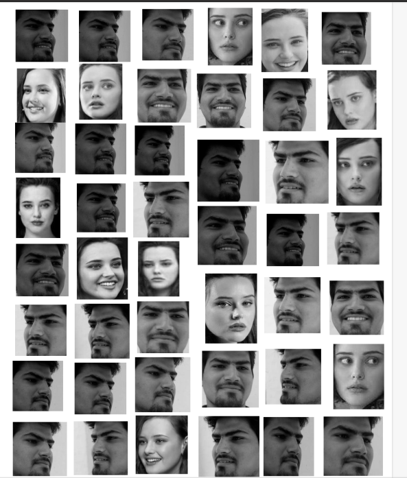

# My_Face_Model
This Model Classify my face with others as you can see images, I use for the training model in the file CNN_IMAGE_pdf.

These are the some of the picture of the face, I extract from Image using the pillow library and face_location.
These Pictures used for the training data of my CNN Model for classification of myface.

